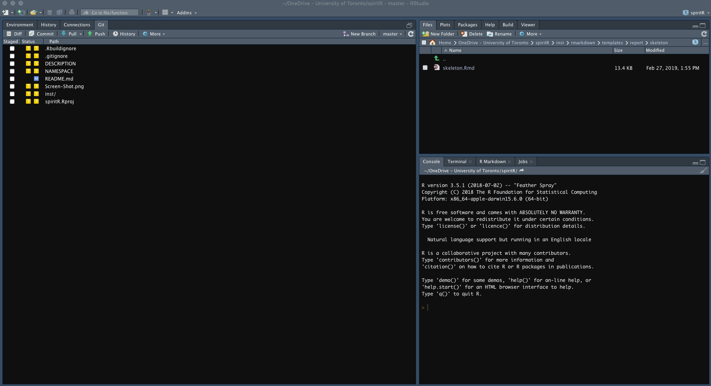

# spiritR

***************

This repository contains an Rmarkdown template for a clinical trial protocol adhering to the [SPIRIT](http://www.spirit-statement.org/) checklist.

Contained within the template is a section for each of the elements that should be adressed in a clinical trial protocol. Links to the SPIRIT statement guidance about what should be addressed in each element are provided.

Future plans are to:

* Create a function that will make use of the clinicaltrials.gov API to assist uploading information from the protocol developed in your Rmardown file to a new clinical trial record. 

# Installing the Templates
****************************

Enter the following in your console for installation (uncomment the first line if devtools is not already installed):

    # install.packages("devtools")
    devtools::install_github("awconway/spiritR")

  
Once installed, the template will be available within the RStudio IDE by selecing 'New File' > 'R Markdown' > "From Template" as shown below:
  
  
  
  