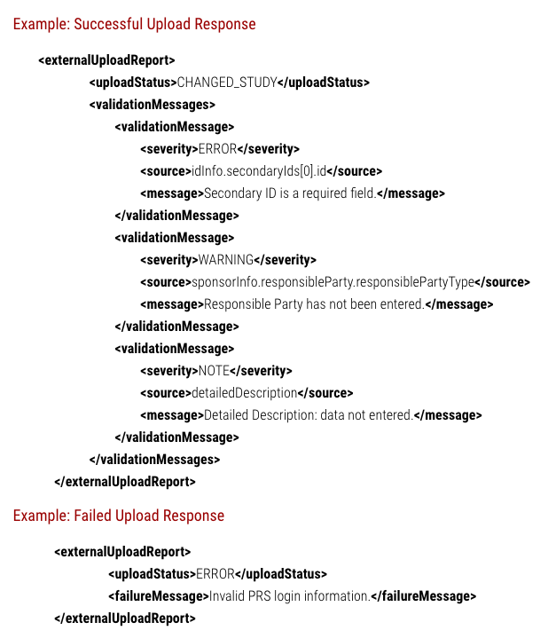

```{r setup, include = FALSE}
knitr::opts_chunk$set(
  collapse = TRUE,
  comment = "#>"
)
```

## The SPIRIT statement

The [SPIRIT](http://spirit-statement.org) (Standard Protocol Items for Interventional Trials) statement outlines recommendations for a minimum set of elements to be addressed in a  clinical trial protocol [@chan2013spirit]. In order to assist clinical trial protocol development, the spiritR package provides an Rmarkdown template containing each of the elements from the SPIRIT statement. The Rmarkdown template provides hyperlinks to the relevant section of the SPIRIT statement webpage for guidance.

## Registering a clinical trial

Pre-registering core study design aspects of a clinical trials minimises the potential for reporting bias. Professional bodies, including the International Committee of Medical Journal Editors, as well as regulatory laws, such as the US Food and Druf Adminstration Amendmednt Act, mandate that clinical trials are registered [@califf2012characteristics; @de2005clinical]. The largest clinical trial registry in the world is [clinicaltrials.gov](http://www.clinicaltrials.gov).

The typical workflow for researchers planning a randomized controlled trial is to generate a clinical trial protocol using word processing software. The information required to register a protocol in the clinicaltrials.gov registry is then cut and paste from that document into the relevant section of the clinicaltrials.gov webpage. The spiritR package aims to automate this process. 

Clinicaltrials.gov permits xml documents that contain the elements required for clinical trial registration to be automatically uploaded through their application programming interface (API). The spiritR package uses functions from the xml2 R package to develop an xml document in a format that adheres to clinicaltrials.gov requirements [@wickhamXml2ParseXML2018]. The httr package is then used to generate a http POST request with parameters needed to interact with the clinicaltrials.gov API [@wickhamHttrToolsWorking2018]. 

## Writing a protocol using the spiritR Rmarkdown template

Once installed, the spiritR Rmarkdown template will be available in RStudio. At the begining of this template are several R code chunks. Contained within these R code chunks is a template to create a list of object names with instructions for what content should be assigned to each.

This template will only work for interventional trials. There are options to register Observational and Epidemiological studies on clinicaltrials.gov but this template will not meet the requirements for the xml upload for these other types of studies.

Assigning values to these objects within the lists will achieve two purposes:

1. To populate a table at the begining of the protocol document displaying the World Health Organization Regitration Data Set; and

2. To populate an xml document that can be uploaded directly to the clinicaltrials.gov registry using the create_ctxml() function by calling do.call("create_ctxml", arguments_ctxml).

Once the lists are created and each section of the protocol template has been completed, the user can proceed to uploading their protocol to clinicaltrials.gov.

For clarification regarding the content to be assigned to these parameters, please refer to the [data element definitions](https://prsinfo.clinicaltrials.gov/definitions.html) provided by clinicaltrials.gov.

## Uploading a clinical trial protocol to clinicaltrials.gov

### create_ctxml()

This function will create the initial xml document containing elements common to all clinical trial protocols. First be sure to run the code chunks in the Rmarkdown spiritR clinical trial protocol containing the lists of arguments. Then, create an xml document by calling do.call("create_ctxml", arguments_ctxml). 

### add_functions()

This family of functions will add nodespaces to the initial xml document generated from create_ctxml() with elements that are unique to a particular clinical trial. For example, every clinical trial must have at least one primary outcome. For this reason, primaryOutcome1 is an argument contained within create_ctxml(). However, the total number of primary and seconday outcomes will vary between studies. As such, the add_pr_outcome() and add_sec_outcome() functions are included in the spiritR package so that clinical trial protocol authors can tailor the xml document for upload to clinicaltrials.gov with the specific number of outcomes and details of their study. Likewise, all clinical trials must have at least one arm testing one intervention but the total number can vary. The add_arm(), add_intervention(), add_condition() and add_keyword() functions provide the functionality to add xml nodespaces containing this information to the initial xml document.

### print_ctxml()

The print_ctxml() function is provided to permit the user to check the structure of the xml document produced by calling the create_ctxml() and relevant add_functions() prior to attempting to upload the document to clinicaltrials.gov. 

### upload_ctxml()

After the complete xml document is generated by calling the create_ctxml() and relevant add_functions() (and optionally inspected using print_ctxml), the user can upload it to clinicaltrials.gov using upload_ctxml(). Arguments for upload_ctxml() include:

1. The ctxml object;
2. The organisation name associated with a clinicaltrials.gov account;
3. Username for a clinicaltrials.gov account; and
4. Password for a clinicaltrials.gov account.

There are three possible outcomes for a call to upload_ctxml(). As per the [guidance](https://prsinfo.clinicaltrials.gov/prs-users-guide.html#xml) from clinicaltrials.gov, a correct http POST request will generate a 200 status code and generate an XML response indicating that the upload was either successful or unsuccessful as per the sample below:



It is possible that a failed upload resulting in a 400 status code in the place of an XML response could be due to incorrect input parameters such as the organization name, username or password for the account.


>Even in the event of a successful upload, this function has been programmed with the http POST request 'autoRELEASE' argument set to FALSE. This means that users will need to log-in to clinicaltrials.gov directly to inspect their upload, attend to any warning messages that may have been alerted, and then 'release' the submission for PRS review by clinicaltrials.gov.

## References


